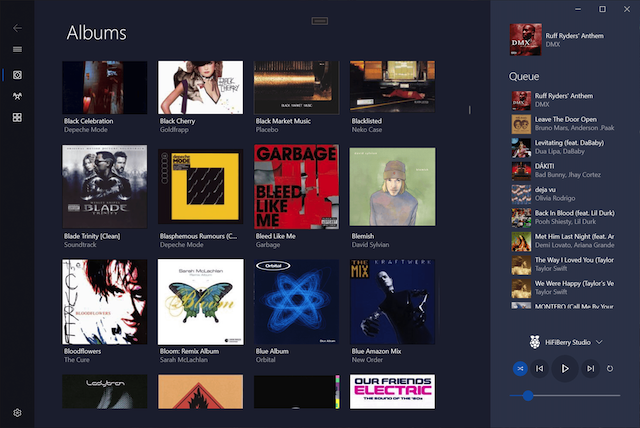
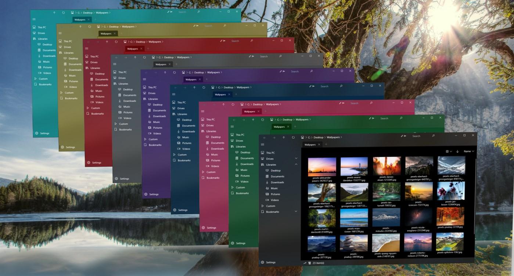
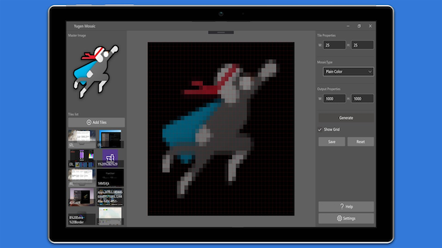
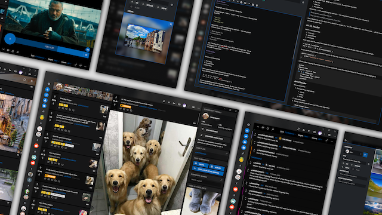

# Welcome to the Wiki page of Windows Community Toolkit :toolbox:

We are glad you are here and one step closer to learn more about this amazing platform and the ways you can contribute :raised_hands:

The section on the right will help you navigate and answer all the questions you may have regarding the toolkit. You can submit an issue to suggest any changes, introduce features, file bug reports, or leave a Windows Community Toolkit related question. You can also submit a pull request and contribute many other ways listed in the Contribution Section to the right.

Every single contribution of yours will improve and strengthen the performance of the toolkit. Let's jump into the ride 🎢

### Feedback and Requests
Please use [GitHub Issues](https://github.com/windows-toolkit/WindowsCommunityToolkit/issues) for bug reports and feature requests. For general questions and support, please use [Stack Overflow](https://stackoverflow.com/questions/tagged/windows-community-toolkit) where questions should be tagged with the tag `windows-community-toolkit`. You can also chat with community members about the project in our [UWP Community Discord](https://discord.gg/zBA5aCn) channel.

### Social Media

Use the [`#WindowsCommunityToolkit`](https://twitter.com/search?q=%23WindowsCommunityToolkit&f=live) hashtag on Twitter to share what you're working on with the community! You can also find the Toolkit on the web in the following locations:

- Windows Blogs - Release Overviews - [Search for Windows Community Toolkit](https://blogs.windows.com/?s=Windows+Community+Toolkit)
- Dev Blogs - [Other Articles](https://devblogs.microsoft.com/pax-windows/)
- We may sometimes add to the [.NET Foundation Newsletter](https://github.com/dotnet-foundation/website/blob/master/input/blog/posts/_current-newsletter-draft.md) too!

## Projects using the Windows Community Toolkit

Below are a few projects highlighting usage of the Windows Community Toolkit from other creators in our Community. We hope they inspire you to see the possibilities of what you're able to create with the tools provided in our library.

### [Fiona](https://www.mysqueezebox.com/download) by [PaoloM](https://github.com/PaoloM)

Fiona was started using the WCT Template ([from Windows Template Studio](https://aka.ms/wts)), and it's using a bunch of the helpers and services provided with that. Plus, as mentioned, the toolkit MVVM.

[Fiona Github](https://github.com/PaoloM/Fiona)

### [Shrestha Files Pro](https://www.microsoft.com/p/shrestha-files-pro-a-modern-dual-panel-file-manager-with-tabs-and-colors/9npnffsv2hqm) by

Shrestha Files is a modern and minimalist dual pane file manager with tabs and color themes support.

- It uses GridSplitter in dual pane mode to resize two panes.
- It uses Guard to validate arguments.
- It uses MVVM toolkit and is gradually moving to MVVM-ify more! All settings pages and navigation bar edit page mostly follow MVVM pattern.    
- It uses EnumValuesExtensions since the last version to load enum values in SplitButton options for view type and sort type.

 Here's a quick overview of: [Shretha Files](https://youtu.be/-LBXu0lzh_Y "https://youtu.be/-LBXu0lzh_Y"). More information about the app [here](https://jptgamesandapps.github.io/ShresthaFiles/)

### [Yugen Mosaic](https://www.microsoft.com/en-us/p/yugen-mosaic/9pf0s24cx0d4) by [PandaSharp](https://github.com/Panda-Sharp)

Yugen Mosaic is a free app that creates digital art pictures based on your own images. With it, you can use an unlimited amount of images, to create a photo mosaic which is an image composed of many tiled photos. Yugen is an awareness of the universe that triggers emotional responses too deep and powerful for words, and that is just what your art will do with a little help from Yugen Mosaic!

[Yugen Mosaic Github](https://github.com/Panda-Sharp/Yugen.Mosaic)

### [Legere](https://www.microsoft.com/en-us/p/legere-for-reddit/9phjrvcskvjz?rtc=1&activetab=pivot:overviewtab) by [Sergio Pedri](https://github.com/Sergio0694)

Legere is a fully customizable UWP client for Reddit supporting multiple users, live tiles, myTube! integration, and more.

> Quote from Sergio

> ***I'm using several Toolkit controls like the WrapPanel to display post tags, as well as lots of helpers. I'm currently in the process of migrating the codebase to the Toolkit 7.0***
