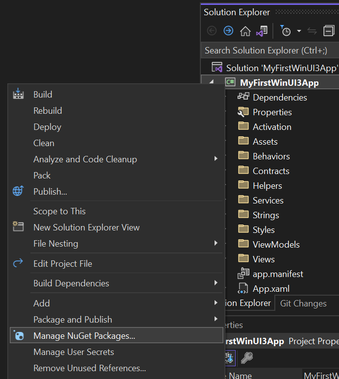
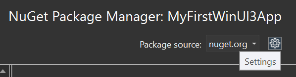
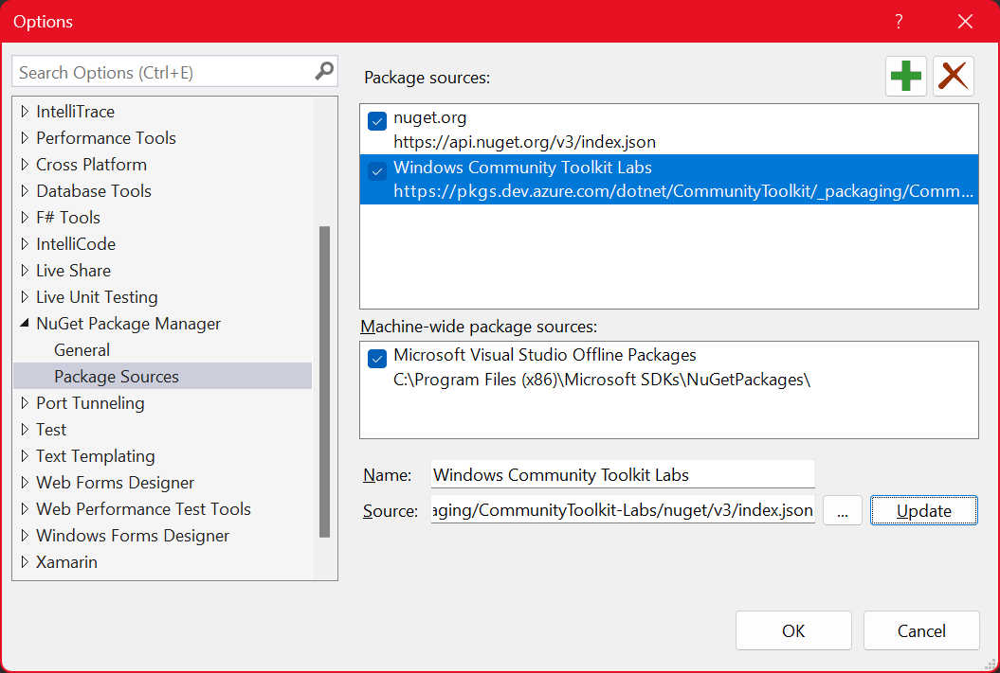
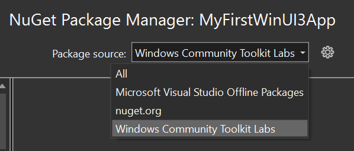

# Community Toolkit Preview Packages

The Community Toolkit has a variety of ways to test out new features or fixes ahead of their official release. This page describes the various channels available and how to connect them to your development environment.

🐉 **Note:** With any of these previews there are APIs, controls, or features which may change or be removed before the final release. They are intended to make it easier for developers to provide feedback on them ahead of time so we can gauge interest or ensure they cover a broad range of scenarios before we ship them. When upgrading between versions of packages in preview may contain breaking changes, a package may stop being updated, or change names/location. Ensure you accept these risks when integrating these previews into your software.

## How to add a Feed to Visual Studio

In order to use a NuGet feed, you need to add it to your Visual Studio configuration. This is most easily accessed from the NuGet Package Manager available when right-clicking on your project and selecting `Manage NuGet Packages...`:

On the page that opens, you can go to the feed options by clicking on the `Settings` gear icon in the top-right:

Then, you can add your desired feed (see info on feeds below) as a new feed option with the `+` (plus) button:

⚠ Don't forget to press the `Update` button after changing the text fields with the feed `Name` and `Source`. Then, click `OK`.

That will allow you to select it as a feed location to search for packages in the top-right dropdown, for instance:

Voila! ✨ You can now go to the `Browse` tab and discover the preview packages which await you.

## Available Preview Feeds

We have a number of public NuGet feeds hosted from our Azure DevOps pipeline. These are not found by default when searching the main NuGet server from within Visual Studio. You must add alternate [Package sources](https://docs.microsoft.com/nuget/consume-packages/install-use-packages-visual-studio#package-sources), as we described above, within the Visual Studio settings or if sharing within a team/project setup [packageSources](https://docs.microsoft.com/nuget/reference/nuget-config-file#packagesources) within a `nuget.config` file.

Below is a list of available package feeds from the Community Toolkits.

### Toolkit Labs 🧪

Feed URL: `https://pkgs.dev.azure.com/dotnet/CommunityToolkit/_packaging/CommunityToolkit-Labs/nuget/v3/index.json`

The [[Toolkit Labs]] feed contains various _**experimental**_ projects that are being incubated by our team and the community. This feed is provided as an easy way to pull them into projects to test out and provide feedback to their developers. Projects either have their own dedicated repository or come from a central general Lab repo (per technology), but they all push to this feed. See the [[Toolkit Labs]] page in this wiki for more details on our current experiments and where to find more information.

### Latest 🌙

Feed URL: `https://pkgs.dev.azure.com/dotnet/CommunityToolkit/_packaging/CommunityToolkit-MainLatest/nuget/v3/index.json`

The Latest feed is updated whenever a change is merged to the main branch of a Community Toolkit. It contains the latest changes to the next versions of the Community Toolkit. It is a great feed to help test the latest set of features which have gone through the development process and are pending release. (_Note: It is possible new features can still be changed or removed before a release._)

### Pull Requests 🚧

Feed URL: `https://pkgs.dev.azure.com/dotnet/CommunityToolkit/_packaging/CommunityToolkit-PullRequests/nuget/v3/index.json`

🚨 The Pull Request feed is automatically built from PRs that are submitted. They may contain untested features, unreviewed fixes, and code which has not been validated. It is important to understand these risks before pulling a package from this feed.

That said, the Pull Request feed is a great feed to help other developers test and review their features before they are added to the Toolkit. To find the appropriate package version, just check for the last successful build of the PR at the bottom of the page in the PR checks. You can expand it by clicking on `Show all checks` and then finding the version next to the `Toolkit-CI` check, as seen here:

📝 Note, the package in the feed will have a '.g' replacing the '+' seen in this visual for the PR. [See Nerdbank Docs here](https://github.com/dotnet/Nerdbank.GitVersioning/blob/master/doc/dotnet.md).

### ~~WinUI 3 Previews~~ (Archive)

⚠ Note: Stable versions of these packages aligned with the Windows App SDK have been released and are available on NuGet now, find latest information [here](https://aka.ms/wct-winui3).

## Preview Packages on NuGet

Occasionally, as we prepare for an official release, we may release preview packages to NuGet directly. This allows us to more easily reach a broader audience with a scoped set of updates we want developers to try out before we ship. Generally these releases are more stable and less prone to having breaking changes in them before the release (though it still may occur). This process allows us to gather feedback from more developers and make any final changes before we 'lock them in' for a release.

To access these previews, simply ensure you have the [Include prerelease](https://docs.microsoft.com/nuget/create-packages/prerelease-packages#installing-and-updating-pre-release-packages) checkbox checked in Visual Studio. This will search and display any preview packages in the version dropdown for Windows Community Toolkit [[NuGet Packages]]. We typically use the suffix `-preview` for any of these releases or sometimes will use `-rc` for a package that is intended to be the final release if no major issues are discovered.
