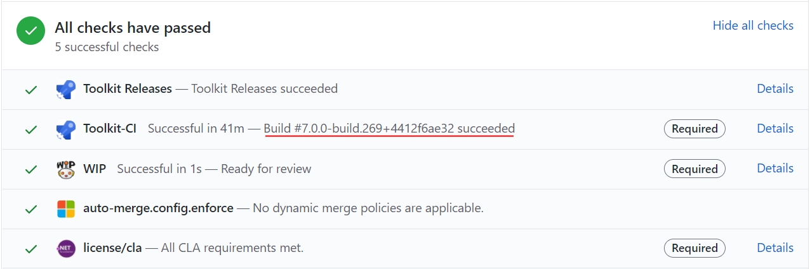

The Windows Community Toolkit has a variety of ways to test out new features or fixes ahead of their official release. This page describes the various channels available and how to connect them to your development environment.

🚨 It's important to note that with any of these previews, there are APIs, controls, or features which may change or be removed before the final release. They are intended to make it easier for developers to provide feedback on them ahead of time so we can gauge interest or ensure they cover a broad range of scenarios before we ship them. Therefore, it's important to not rely on the preview package too heavily or use within production software without understanding these risks.

# 'Official' Preview Packages

As we prepare for an official release, we may release 'official' preview packages to NuGet itself, this allows us to more easily reach a broader audience with a scoped set of updates we want developers to try out before we ship. This allows us to gather feedback and make changes before we 'lock them in' for a release.

To access these previews, you can simply ensure you have the [Include prerelease](https://docs.microsoft.com/en-us/nuget/create-packages/prerelease-packages#installing-and-updating-pre-release-packages) checkbox checked in Visual Studio. This will search and display any preview packages in the version dropdown for Windows Community Toolkit [[NuGet Packages]]. We typically use the suffix `-preview` for any of these releases.

# Azure Feeds

We have a number of public NuGet feeds hosted from our Azure DevOps pipeline. These are not found by default when searching the main NuGet server from within Visual Studio. You must add alternate [Package sources](https://docs.microsoft.com/en-us/nuget/consume-packages/install-use-packages-visual-studio#package-sources) within the Visual Studio settings or if sharing within a team/project setup [packageSources](https://docs.microsoft.com/en-us/nuget/reference/nuget-config-file#packagesources) within a `nuget.config` file.

## Latest

Feed URL: `https://pkgs.dev.azure.com/dotnet/CommunityToolkit/_packaging/CommunityToolkit-MainLatest/nuget/v3/index.json`

The Latest feed is updated whenever a change is merged to the main branch. It contains the latest changes to the next version of the Windows Community Toolkit. It is a great feed to help test the latest set of features which have gone through the development process.

## Pull Requests

Feed URL: `https://pkgs.dev.azure.com/dotnet/CommunityToolkit/_packaging/CommunityToolkit-PullRequests/nuget/v3/index.json`

🚨 The Pull Request feed is automatically built from PRs that are submitted. They may contain untested features, unreviewed fixes, and code which has not been validated. It is important to understand these risks before pulling a package from the feed.

That said, the Pull Request feed is a great feed to help other developers test and review their features before they are added to the Toolkit. To find the appropriate package version, just check for the last successful build of the PR at the bottom of the page in the PR checks. You can expand it by clicking on `Show all checks` and then finding the version next to the `Toolkit-CI` check, as seen here:

📝 Note, the package in the feed will have a '.g' replacing the '+' seen in this visual for the PR. [See Nerdbank Docs here](https://github.com/dotnet/Nerdbank.GitVersioning/blob/master/doc/dotnet.md).

## WinUI 3 Previews

⚠ Note: Stable versions of these packages aligned with the Windows App SDK have been released and are available on NuGet now, find latest information [here](https://aka.ms/wct-winui3).

Feed URL: `https://pkgs.dev.azure.com/dotnet/CommunityToolkit/_packaging/CommunityToolkit-WinUI3/nuget/v3/index.json`

The [WinUI 3](https://aka.ms/winui3) feed contains our latest packages compatible with WinUI 3 for Desktop developers. You can find more about how the Toolkit works with these previews [here](https://aka.ms/wct-winui3).

This is a separate feed for now as we have not changed our package names or namespaces from `.UWP.` to `.WinUI.`. This makes it easier for developers to use existing code and samples to test the Windows Community Toolkit on top of WinUI 3, but would break any existing UWP apps if accidently pulled down as a 'newer' preview from a regular feed location. For this reason, we've isolated the WinUI 3 previews into their own distinct feed for those developers.

Our plan is most likely to use new package names/namespaces as other libraries have started adopting as common practice. When we get closer to moving the Toolkit to build entirely on top of WinUI 3 after it supports Desktop and UWP developers on top of the latest .NET, we will update our packages and namespaces to a new format and start shipping 'official' previews on NuGet as well.
