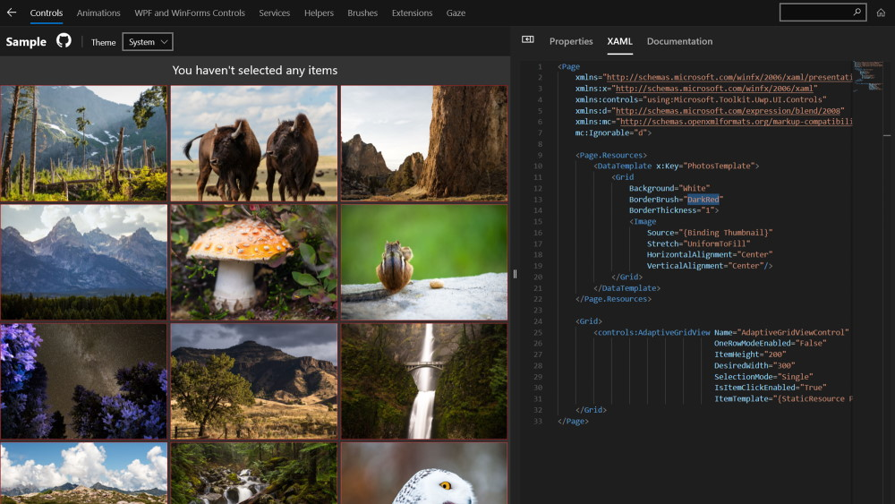

Want to see the toolkit in action before jumping into the code? 

Download and play with the [Windows Community Toolkit Sample App](https://aka.ms/windowstoolkitapp) from the Store.

It lets you try out different properties and configurations easily as well as edit the XAML and see updates live within the app. It's a great place to get acquainted with the Toolkit and what is available to help you build great applications.

📝 If you discover issues with components, see if you can reproduce them in the Sample App. It makes it much easier to debug and fix issues which can be reproduced within the app itself.
